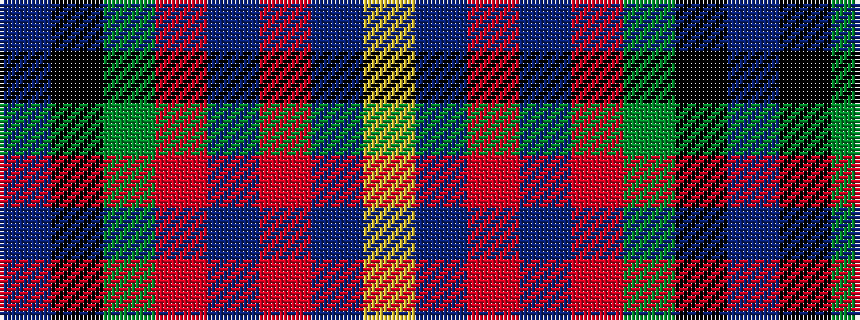

BKGRBRBY

It is a 8 stripe tartan.

<figure class="pat-woven">

<figcaption>idealised sample</figcaption>
</figure>

## Colour Sequence



## Tartans with this colour sequence

| Tartans |
|---------------|
| [Sustainability (Fashion)](/variants/s8/db20k3g18r12t4r12db15ly4~x2/)|
||
