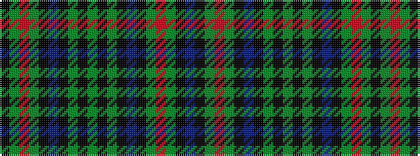

BKGRGKBKGKGKGKBKGRGK

It is a 20 stripe tartan.

<figure class="pat-woven">

<figcaption>idealised sample</figcaption>
</figure>

## Colour Sequence



## Tartans with this colour sequence

| Tartans |
|---------------|
| [Highfield Hunting](/variants/s20/db10k2g2r2g2k2do2k2dy4k1y2~x4/)|
||
