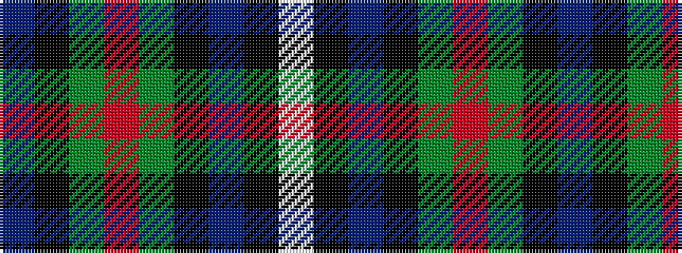

BKGRGKBKW

It is a 9 stripe tartan.

<figure class="pat-woven">

<figcaption>idealised sample</figcaption>
</figure>

## Colour Sequence



## Tartans with this colour sequence

| Tartans |
|---------------|
| [Dove (Personal)](/variants/s9/n33k16g17o3g17k16n15k3w3~x2/)|
||
