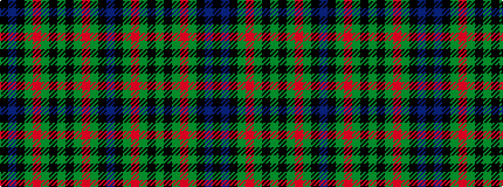

BKGRGKGKGRGKBK

It is a 14 stripe tartan.

<figure class="pat-woven">

<figcaption>idealised sample</figcaption>
</figure>

## Colour Sequence



## Tartans with this colour sequence

This pattern is a design lineage: every tartan below shares one colour order, whatever its owner —
near-identical designs are grouped, the largest lineage first (#112: the pattern is a tartan's
second parent, beside its family or clan).

<table class="sett-table">
<tbody>
<tr><td><a href="/variants/s14/db88k15g9r12g20k3y8k6g20r12g9k15db24k36/">Gillies</a></td></tr>
<tr><td class="sett-swatch"></td></tr>
<tr><td><a href="/variants/s14/db88k15g9r12g20k3y8k3g20r12g9k15db24k36~x2/">Gillies</a></td></tr>
<tr><td class="sett-swatch"></td></tr>
<tr><td><a href="/variants/s14/db18k5g3r3g6k2y2k2g6r3g3k10db5k10/">MacClellan Clan Tartan</a></td></tr>
<tr><td class="sett-swatch"></td></tr>
<tr><td><a href="/variants/s14/db15k8g3r3g5k2y2k2g5r3g3k8db8k8~x4/">MacLellan</a></td></tr>
<tr><td class="sett-swatch"></td></tr>
<tr><td><a href="/variants/s14/db29k15g5r5g8k4y4k4g8r5g5k15db7k15~x2/">MacLellan Clan Tartan</a></td></tr>
<tr><td class="sett-swatch"></td></tr>
</tbody>
</table>

