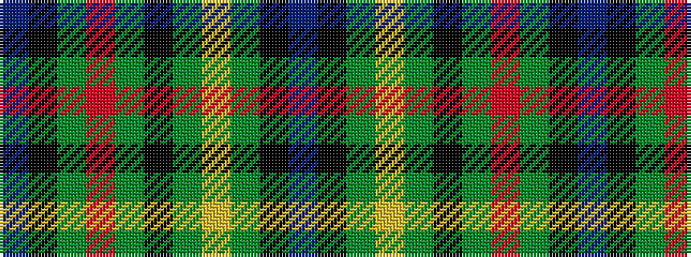

BKGRGKGYGKB

It is a 11 stripe tartan.

<figure class="pat-woven">

<figcaption>idealised sample</figcaption>
</figure>

## Colour Sequence



## Tartans with this colour sequence

| Tartans |
|---------------|
| [Pendleton dress](/setts/s11/db6ki40dg34r5dg34k6dg34ly5dg34ki40db6/)|
||
| [Pendleton hunting](/setts/s11/db2ki16dg14r3dg14k3dg14lo3dg14ki16db2/)|
||
