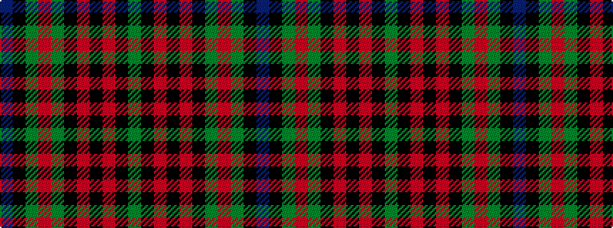

BKGRGKRKRKG

It is a 11 stripe tartan.

<figure class="pat-woven">

<figcaption>idealised sample</figcaption>
</figure>

## Colour Sequence



## Tartans with this colour sequence

| Tartans |
|---------------|
| [Highfield (Name)](/variants/s11/db10k2g2r2g2k2r2k2r4k1g2~x4/)|
||
