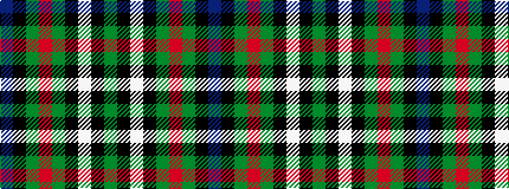

BKGRGKWKG

It is a 9 stripe tartan.

<figure class="pat-woven">

<figcaption>idealised sample</figcaption>
</figure>

## Colour Sequence



## Tartans with this colour sequence

| Tartans |
|---------------|
| [Ferguson (Tarlogie)](/variants/s9/b24k8g8r2g4k1w2k1g4~x2/)|
||
