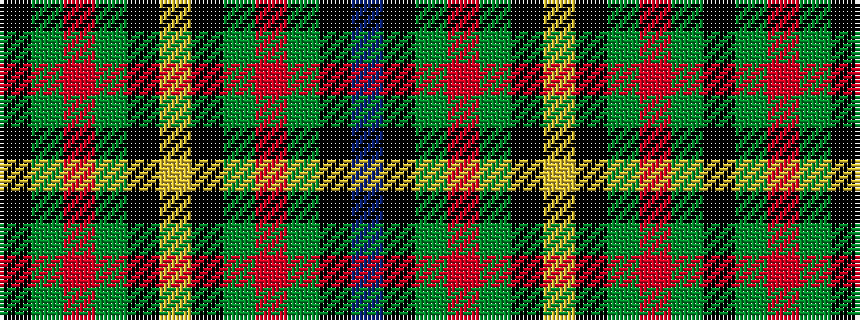

BKGRGKYKGRGK

It is a 12 stripe tartan.

<figure class="pat-woven">

<figcaption>idealised sample</figcaption>
</figure>

## Colour Sequence



## Tartans with this colour sequence

| Tartans |
|---------------|
| [Wilson's No.232](/setts/s12/b18k7g5r4g7k1ly2~x2/)|
||
