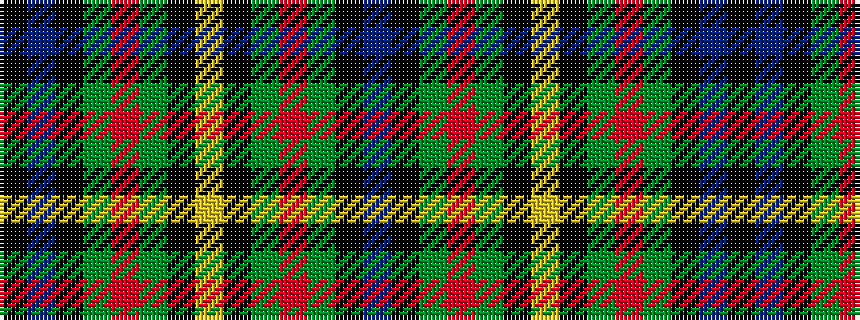

BKGRGKYKGRGKBK

It is a 14 stripe tartan.

<figure class="pat-woven">

<figcaption>idealised sample</figcaption>
</figure>

## Colour Sequence



## Tartans with this colour sequence

| Tartans |
|---------------|
| [Gillies](/setts/s14/db88k15g9r12g20k3ly8k6g20r12g9k15db24k36/)|
||
| [Gillies](/setts/s14/db88k15g9r12g20k3ly8k3g20r12g9k15db24k36~x2/)|
||
| [MacClellan](/setts/s14/db18k5dg3r3dg6k2ly2k2dg6r3dg3k10db5k10/)|
||
| [MacClellan](/setts/s14/db18k5g3r3g6k2ly2k2g6r3g3k10db5k10/)|
||
| [MacLellan](/setts/s14/db15k8g3r3g5k2ly2k2g5r3g3k8db8k8~x4/)|
||
| [MacLellan Clan Tartan Tartan Number: 323. Earliest known date: pre 2003 Very similar to MacLaren See products available Copyright © Blair Urquhart, Comrie, 2015](/setts/s14/db29k15g5r5g8k4ly4k4g8r5g5k15db7k15~x2/)|
||
