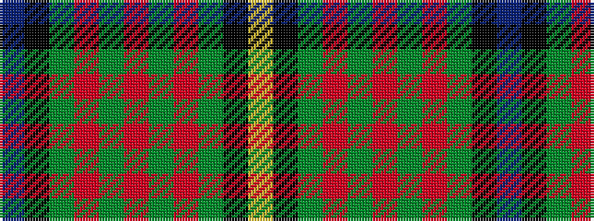

BKGRGRGRGKY

It is a 11 stripe tartan.

<figure class="pat-woven">

<figcaption>idealised sample</figcaption>
</figure>

## Colour Sequence



## Tartans with this colour sequence

| Tartans |
|---------------|
| [Minnock (Name)](/variants/s11/db50k14g3r2g3r2g3r2g3k2lo2~x2/)|
||
| [Muir/Moore](/variants/s11/db60k15g10r2g10r2g10r2g10k1ly4~x2/)|
||
