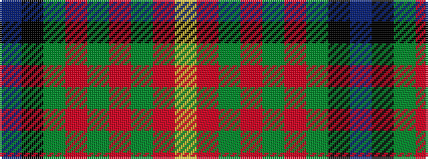

BKGRGRGRY

It is a 9 stripe tartan.

<figure class="pat-woven">

<figcaption>idealised sample</figcaption>
</figure>

## Colour Sequence



## Tartans with this colour sequence

| Tartans |
|---------------|
| [Fulton](/setts/s9/dp3k1g16r5g6r5g14r16lo2~x2/)|
||
