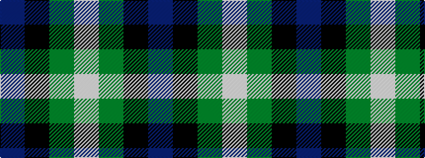

BKGW

It is a 4 stripe tartan.

<figure class="pat-woven">

<figcaption>idealised sample</figcaption>
</figure>

## Colour Sequence



## Tartans with this colour sequence

| Tartans |
|---------------|
| [Wilson's No 220](/variants/s4/dp8k11dg9w2~x2/)|
||
| [Wilson's No.220](/variants/s4/dp5k5g5w1~x4/)|
||
| [Wilson's, No 220](/variants/s4/p8k11g9w2~x2/)|
||
