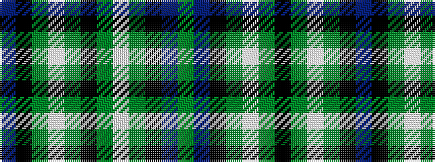

BKGWGKGWGKBG

It is a 12 stripe tartan.

<figure class="pat-woven">

<figcaption>idealised sample</figcaption>
</figure>

## Colour Sequence



## Tartans with this colour sequence

| Tartans |
|---------------|
| [Wilson's No.233](/setts/s12/dp6k6g6w1g6k6g6w1g6k6dp6y1~x4/)|
||
