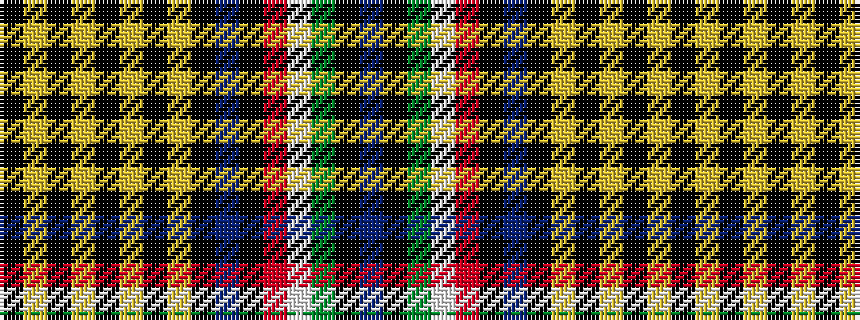

BKGWRKBKYKYKYKYK

It is a 16 stripe tartan.

<figure class="pat-woven">

<figcaption>idealised sample</figcaption>
</figure>

## Colour Sequence



## Tartans with this colour sequence

| Tartans |
|---------------|
| [Baseggio Name Tartan](/variants/s16/t4k6g1w1r1k6t4k2lo1k1lo1k1lo1k2lo3k3~x4/)|
||
