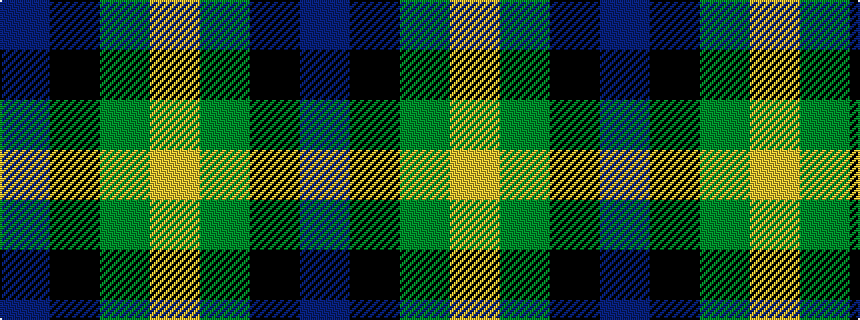

BKGY

It is a 4 stripe tartan.

<figure class="pat-woven">

<figcaption>idealised sample</figcaption>
</figure>

## Colour Sequence



## Tartans with this colour sequence

| Tartans |
|---------------|
| [Sinclair of Ulbster (Portrait)](/variants/s4/b12k4g6ly1~x8/)|
||
| [Sinclair, Sir John](/variants/s4/db16k6g8ly1~x2/)|
||
| [Wilson's, No 195](/variants/s4/lo5g7k1t1~x4/)|
||
| [Wilson's, No 196](/variants/s4/lo9g9k10t2~x2/)|
||
