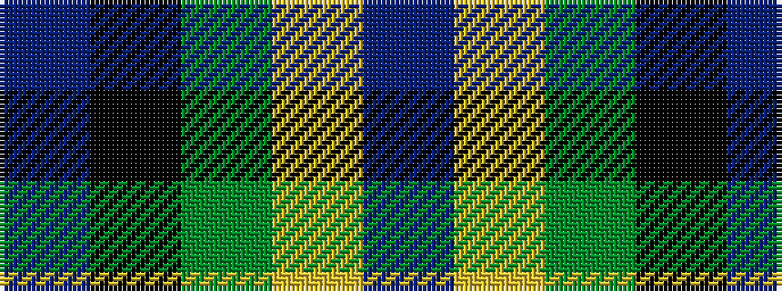

BKGYB

It is a 5 stripe tartan.

<figure class="pat-woven">

<figcaption>idealised sample</figcaption>
</figure>

## Colour Sequence



## Tartans with this colour sequence

| Tartans |
|---------------|
| [Prince of Orange #2](/setts/s5/db6lo25dy16k2db3~x2/)|
||
