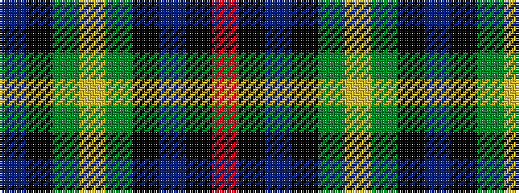

BKGYGKBKR

It is a 9 stripe tartan.

<figure class="pat-woven">

<figcaption>idealised sample</figcaption>
</figure>

## Colour Sequence



## Tartans with this colour sequence

| Tartans |
|---------------|
| [Huntly Gordon Fancy Tartan](/variants/s9/b22k12g11ly2g11k12b11k2r2~x2/)|
||
