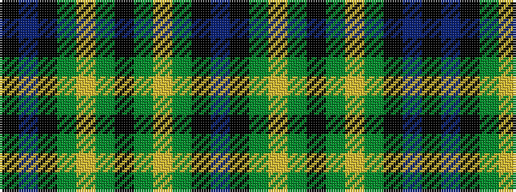

BKGYGKGYGKBK

It is a 12 stripe tartan.

<figure class="pat-woven">

<figcaption>idealised sample</figcaption>
</figure>

## Colour Sequence



## Tartans with this colour sequence

| Tartans |
|---------------|
| [Wilson's No.064](/variants/s12/dp12k13dg12ly2dg12k13dg12ly2dg12k13dp12k2~x2/)|
||
