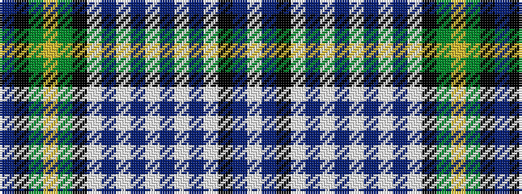

BKGYGKWBWBWBWBWKBW

It is a 18 stripe tartan.

<figure class="pat-woven">

<figcaption>idealised sample</figcaption>
</figure>

## Colour Sequence



## Tartans with this colour sequence

| Tartans |
|---------------|
| [MacNeil Dress](/setts/s18/b18k13g18ly4g18k13w4b4w18b4w4b4w18b4w4k13b18w4~x2/)|
||
| [MacNeil dress](/setts/s18/db18k13g18ly4g18k13w4db4w18db4w4db4w18db4w4k13db18w4~x2/)|
||
