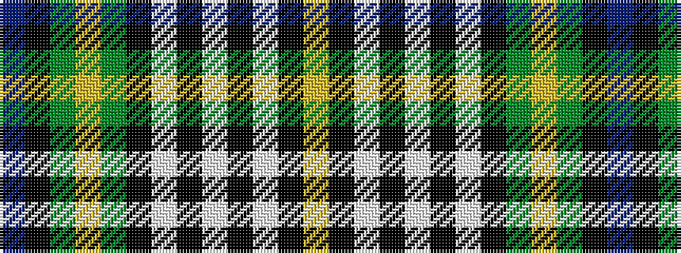

BKGYGKWKWKWKY

It is a 13 stripe tartan.

<figure class="pat-woven">

<figcaption>idealised sample</figcaption>
</figure>

## Colour Sequence



## Tartans with this colour sequence

| Tartans |
|---------------|
| [Gordon Dress #4](/setts/s13/db24k4dg8ly4dg8k4w4k4w24k1w2k1ly3~x2/)|
||
| [Gordon, dress 3](/setts/s13/db24k4g8ly4g8k4w4k4w24k1w2k1ly3~x2/)|
||
