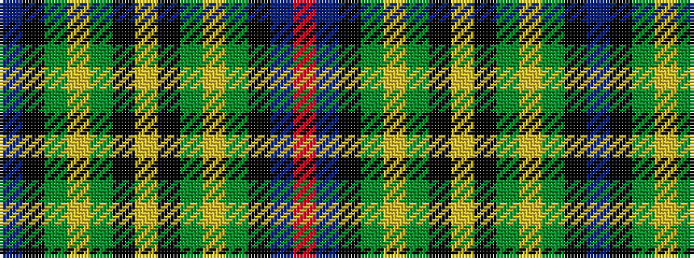

BKGYGKYKGYGKBR

It is a 14 stripe tartan.

<figure class="pat-woven">

<figcaption>idealised sample</figcaption>
</figure>

## Colour Sequence



## Tartans with this colour sequence

| Tartans |
|---------------|
| [Scout Mapping Service #2](/variants/s14/db11k8gi8ly2g8k1ly2k1g8ly2gi8k8db11r2~x2/)|
||
