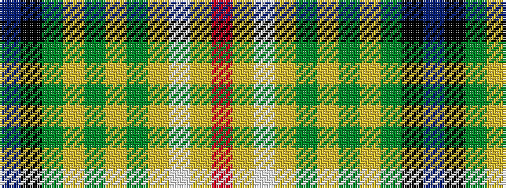

BKGYGYGYWYR

It is a 11 stripe tartan.

<figure class="pat-woven">

<figcaption>idealised sample</figcaption>
</figure>

## Colour Sequence



## Tartans with this colour sequence

| Tartans |
|---------------|
| [Angels' Share, The](/variants/s11/o40ly10w6lo10dy6lo4dy6lo4dy60k34t11/)|
||
