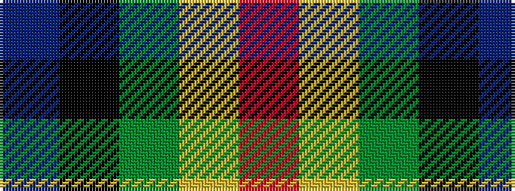

BKGYR

It is a 5 stripe tartan.

<figure class="pat-woven">

<figcaption>idealised sample</figcaption>
</figure>

## Colour Sequence



## Tartans with this colour sequence

| Tartans |
|---------------|
| [Ayllu Thuban](/setts/s5/p46k6g9ly9r4/)|
||
| [Ayllu Thuban (Corporate)](/setts/s5/dp46k6g9lo9r4/)|
||
