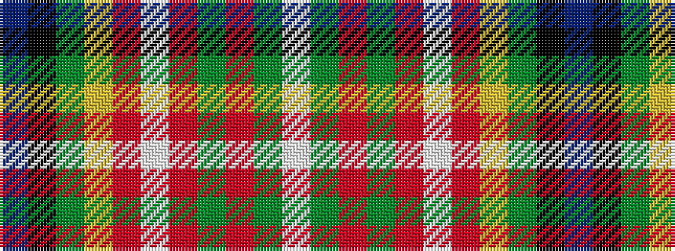

BKGYRWRGRGW

It is a 11 stripe tartan.

<figure class="pat-woven">

<figcaption>idealised sample</figcaption>
</figure>

## Colour Sequence



## Tartans with this colour sequence

| Tartans |
|---------------|
| [Canadian Caledonian Hunting](/setts/s11/db3k1dg16lo1r1lb1r6dg3r1dg3lb1~x4/)|
||
| [Canadian Caledonian, hunting](/setts/s11/db3k1g13ly1r1w1r6g3r1g3w1~x2/)|
||
