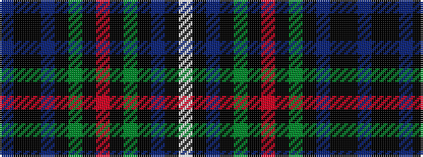

BKKBKGKRKGKBKW

It is a 14 stripe tartan.

<figure class="pat-woven">

<figcaption>idealised sample</figcaption>
</figure>

## Colour Sequence



## Tartans with this colour sequence

| Tartans |
|---------------|
| [Craigclowan School](/setts/s14/db24k2k2db2k12g16k1r3k1g16k12db12k1w3~x2/)|
||
