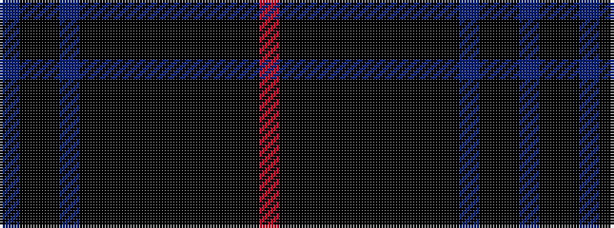

BKKBKKKKKKKKKR

It is a 14 stripe tartan.

<figure class="pat-woven">

<figcaption>idealised sample</figcaption>
</figure>

## Colour Sequence



## Tartans with this colour sequence

| Tartans |
|---------------|
| [Bowcutt, David (Personal)](/setts/s14/db1k4k3dp2k15k2k3k50k2k2k6k2k1r1~x2/)|
||
