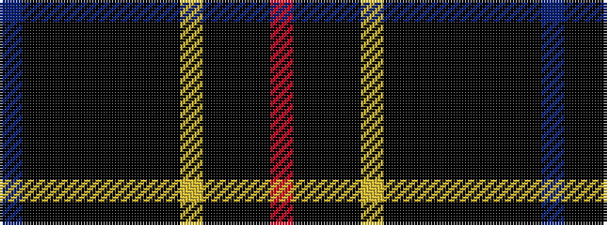

BKKKKKKKYKKKR

It is a 13 stripe tartan.

<figure class="pat-woven">

<figcaption>idealised sample</figcaption>
</figure>

## Colour Sequence



## Tartans with this colour sequence

| Tartans |
|---------------|
| [McFly (School)](/variants/s13/o28k4k6k2lo4k2k6k28k4k2k1k1db2/)|
||
