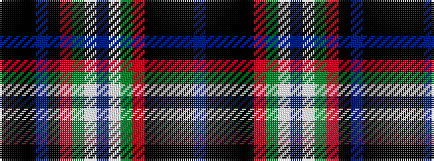

BKKKKRGWBWGRKBKKK

It is a 17 stripe tartan.

<figure class="pat-woven">

<figcaption>idealised sample</figcaption>
</figure>

## Colour Sequence



## Tartans with this colour sequence

| Tartans |
|---------------|
| [Coulter (Personal)](/setts/s17/t7k9k2k2k2r14g14w2t3w2g14r14k2t7k9k2k2~x2/)|
||
