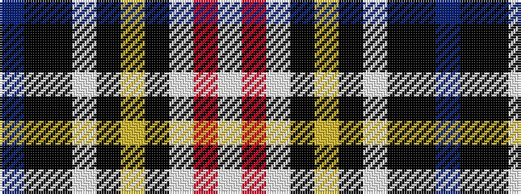

BKKWKYKWRW

It is a 10 stripe tartan.

<figure class="pat-woven">

<figcaption>idealised sample</figcaption>
</figure>

## Colour Sequence



## Tartans with this colour sequence

| Tartans |
|---------------|
| [Scotland's International - Home (Fas](/variants/s10/dt24k24ki2w6ki2ly2ki16lb5r6w2~x2/)|
||
