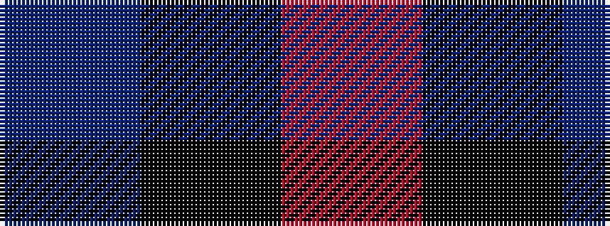

BKR

It is a 3 stripe tartan.

<figure class="pat-woven">

<figcaption>idealised sample</figcaption>
</figure>

## Colour Sequence



## Tartans with this colour sequence

| Tartans |
|---------------|
| [Allen, Nicholas (Personal)](/variants/s3/dt1k2r1~x42/)|
||
| [Wilson's No.198](/variants/s3/r4k7t4~x2/)|
||
