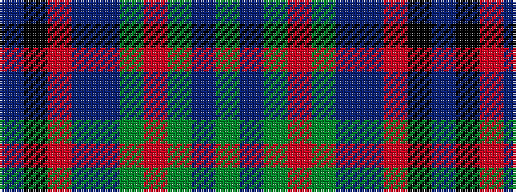

BKRBBGRGBG

It is a 10 stripe tartan.

<figure class="pat-woven">

<figcaption>idealised sample</figcaption>
</figure>

## Colour Sequence



## Tartans with this colour sequence

| Tartans |
|---------------|
| [Downie (Name)](/variants/s10/t24k2r2t2db12g28r4g5t3g3~x2/)|
||
