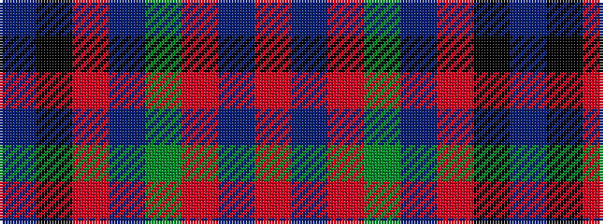

BKRBGRBR

It is a 8 stripe tartan.

<figure class="pat-woven">

<figcaption>idealised sample</figcaption>
</figure>

## Colour Sequence



## Tartans with this colour sequence

| Tartans |
|---------------|
| [McBrayer Blue (Personal)](/setts/s8/db57k1r12db1g12r14db1r2~x2/)|
||
