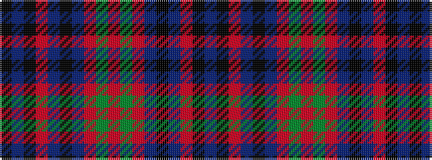

BKRBKBRGRGRBKBRKBK

It is a 18 stripe tartan.

<figure class="pat-woven">

<figcaption>idealised sample</figcaption>
</figure>

## Colour Sequence



## Tartans with this colour sequence

| Tartans |
|---------------|
| [Unidentified (Scolpaig)](/variants/s18/k10t1k1r10t1k1t1r10g6r2~x4/)|
||
