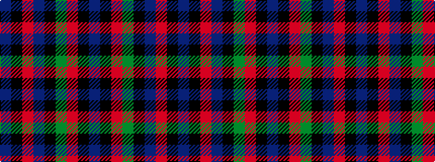

BKRBKGRKB

It is a 9 stripe tartan.

<figure class="pat-woven">

<figcaption>idealised sample</figcaption>
</figure>

## Colour Sequence



## Tartans with this colour sequence

| Tartans |
|---------------|
| [MacNaughton](/variants/s9/t2k2r27dg27k12t12r27k2t2~x2/)|
||
| [Montrose](/setts/b2k2r14dg15k8b7r14k2b2/)|
||
| [Montrose](/setts/db1k1r12g12k6db5r12k1db1/)|
||
