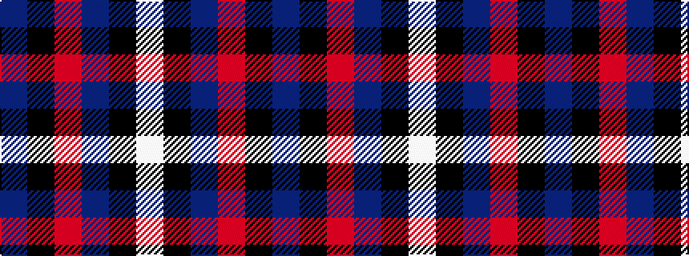

BKRBKW

It is a 6 stripe tartan.

<figure class="pat-woven">

<figcaption>idealised sample</figcaption>
</figure>

## Colour Sequence



## Tartans with this colour sequence

| Tartans |
|---------------|
| [Hong Kong St Andrew's Society](/variants/s6/db75k4r25db6k6w2~x2/)|
||
