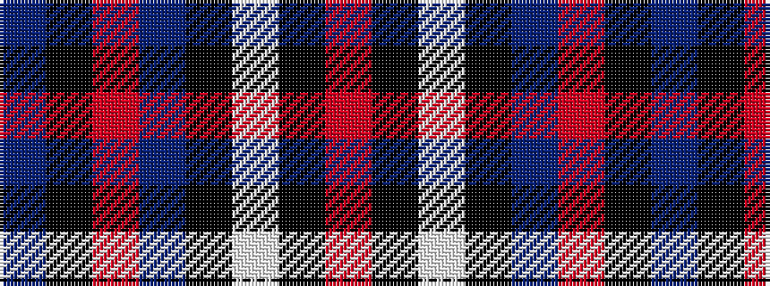

BKRBKWKR

It is a 8 stripe tartan.

<figure class="pat-woven">

<figcaption>idealised sample</figcaption>
</figure>

## Colour Sequence



## Tartans with this colour sequence

| Tartans |
|---------------|
| [Distripress Annual Congress 2012](/setts/s8/r12k2w8k4n16r2k31n2/)|
||
