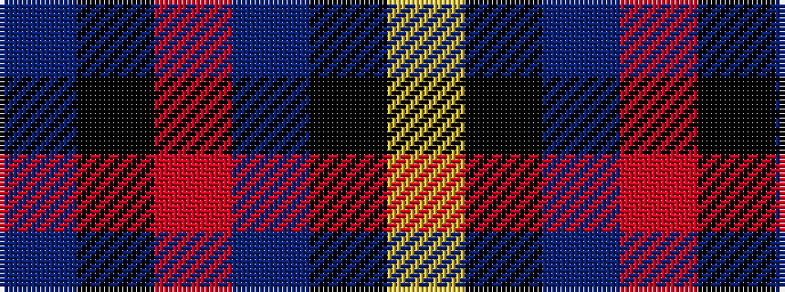

BKRBKY

It is a 6 stripe tartan.

<figure class="pat-woven">

<figcaption>idealised sample</figcaption>
</figure>

## Colour Sequence



## Tartans with this colour sequence

| Tartans |
|---------------|
| [Old Brigade](/setts/s6/db9k9r3db9k9ly1~x4/)|
||
