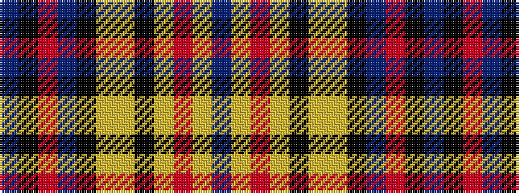

BKRBKYYKYRYB

It is a 12 stripe tartan.

<figure class="pat-woven">

<figcaption>idealised sample</figcaption>
</figure>

## Colour Sequence



## Tartans with this colour sequence

| Tartans |
|---------------|
| [Martinez (2014)](/variants/s12/db6k20r3b2k20ly1ly1k25ly1r2ly1b6~x2/)|
||
