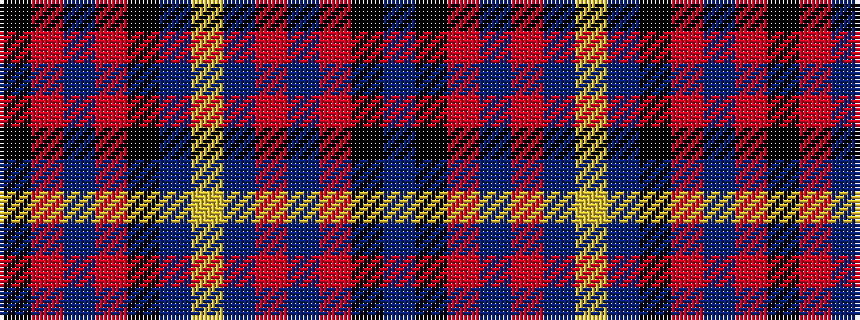

BKRBRBYBKRBRK

It is a 13 stripe tartan.

<figure class="pat-woven">

<figcaption>idealised sample</figcaption>
</figure>

## Colour Sequence



## Tartans with this colour sequence

| Tartans |
|---------------|
| [Wcwm 1445](/variants/s13/db3k1r1n24r1n4lo3db1k4r1n8r1k1~x4/)|
||
