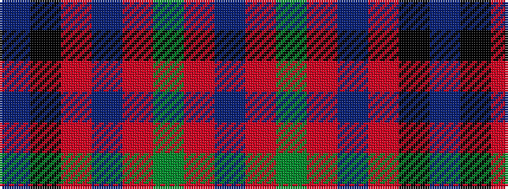

BKRBRGRB

It is a 8 stripe tartan.

<figure class="pat-woven">

<figcaption>idealised sample</figcaption>
</figure>

## Colour Sequence



## Tartans with this colour sequence

| Tartans |
|---------------|
| [Shaw](/setts/b5k1r30n15r8dg30r8n2/)|
||
| [Shaw of Tordarroch](/variants/s8/t5k1r30p15r8g30r8p2~x2/)|
||
| [Shaw of Tordarroch Clan Tartan](/setts/t5k1r30dp15r8g30r8dp2/)|
||
