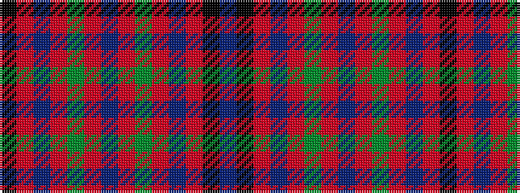

BKRBRGRBRGRBRK

It is a 14 stripe tartan.

<figure class="pat-woven">

<figcaption>idealised sample</figcaption>
</figure>

## Colour Sequence



## Tartans with this colour sequence

| Tartans |
|---------------|
| [Shaw of Tordarroch Red (Dress)](/setts/s14/t5k1r30dp15r8g30r8dp2~x2/)|
||
