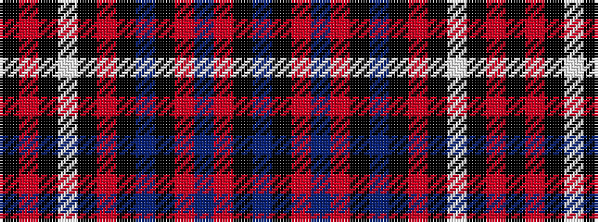

BKRBRKBKRKWKRK

It is a 14 stripe tartan.

<figure class="pat-woven">

<figcaption>idealised sample</figcaption>
</figure>

## Colour Sequence



## Tartans with this colour sequence

| Tartans |
|---------------|
| [Popular](/variants/s14/t8k16r17db19r4k2t7k3r3k2w5k1r3k3~x2/)|
||
