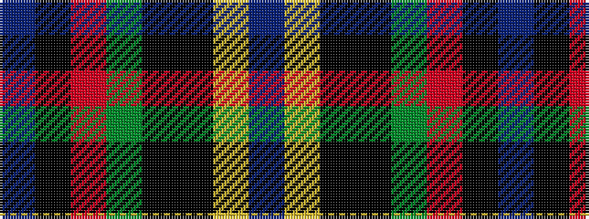

BKRGKKYB

It is a 8 stripe tartan.

<figure class="pat-woven">

<figcaption>idealised sample</figcaption>
</figure>

## Colour Sequence



## Tartans with this colour sequence

| Tartans |
|---------------|
| [Barton-Watson de Bavidge (Personal)](/setts/s8/dp3k16r3dg17ki16k26ly1dp3~x2/)|
||
| [Barton-Watson, de](/setts/s8/p3ki16r3dg17k16ki26ly1p3~x2/)|
||
