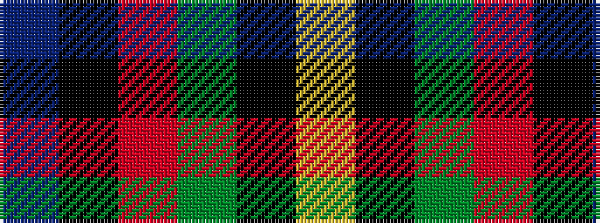

BKRGKY

It is a 6 stripe tartan.

<figure class="pat-woven">

<figcaption>idealised sample</figcaption>
</figure>

## Colour Sequence



## Tartans with this colour sequence

| Tartans |
|---------------|
| [(1) Skene](/variants/s6/b24k4r3g24k4ly3~x2/)|
||
