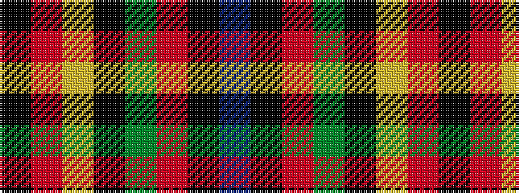

BKRGKYRK

It is a 8 stripe tartan.

<figure class="pat-woven">

<figcaption>idealised sample</figcaption>
</figure>

## Colour Sequence



## Tartans with this colour sequence

| Tartans |
|---------------|
| [Lagavista (Personal)](/variants/s8/k12r8lo4k8dy6r8k22db1~x2/)|
||
