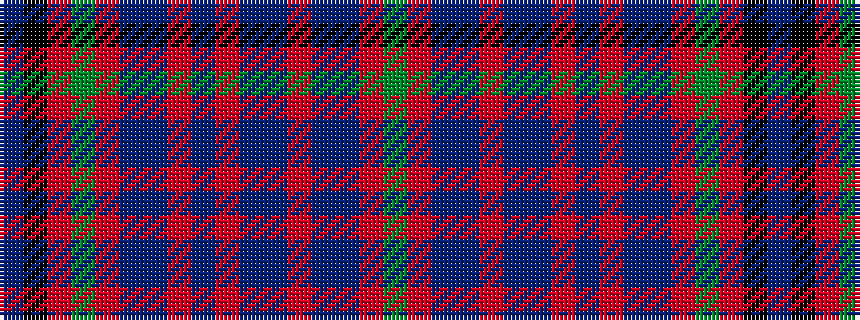

BKRGRBBRBRBBRBBRG

It is a 17 stripe tartan.

<figure class="pat-woven">

<figcaption>idealised sample</figcaption>
</figure>

## Colour Sequence



## Tartans with this colour sequence

| Tartans |
|---------------|
| [Unidentified #14](/variants/s17/dg4r3t1dp1r35dp1t1r3dp16r3t1dp1r2dg35r7k1t2~x2/)|
||
| [Unidentified 15](/variants/s17/g4r3t1p1r35p1t1r3p16r3t1p1r2g35r7k1t2~x2/)|
||
