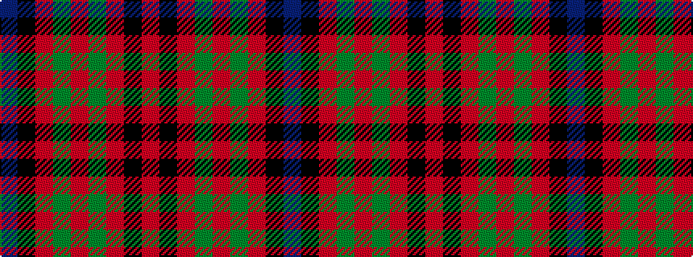

BKRGRGRKR

It is a 9 stripe tartan.

<figure class="pat-woven">

<figcaption>idealised sample</figcaption>
</figure>

## Colour Sequence



## Tartans with this colour sequence

| Tartans |
|---------------|
| [Fulton (1999) (Name)](/variants/s9/db3k5r2g2r3g12r6k1r3~x4/)|
||
