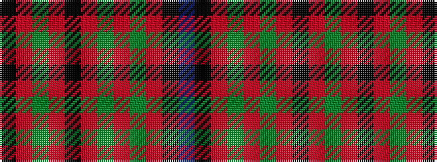

BKRGRGRKRGRK

It is a 12 stripe tartan.

<figure class="pat-woven">

<figcaption>idealised sample</figcaption>
</figure>

## Colour Sequence



## Tartans with this colour sequence

| Tartans |
|---------------|
| [Nicolson](/variants/s12/k10r12g3r12k2r12g3r12g20r2k8t2/)|
||
| [Nicolson MacNicol](/variants/s12/k10r12dg3r12k2r12dg3r12dg20r2k8t2/)|
||
