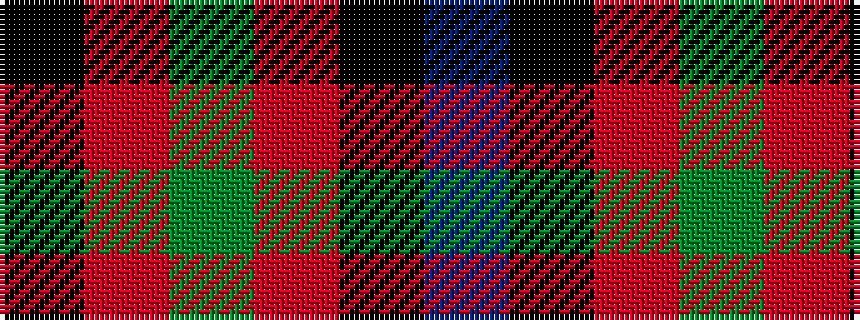

BKRGRK

It is a 6 stripe tartan.

<figure class="pat-woven">

<figcaption>idealised sample</figcaption>
</figure>

## Colour Sequence



## Tartans with this colour sequence

| Tartans |
|---------------|
| [Unidentified #15](/setts/s6/k6r2dg17r16k1t2~x2/)|
||
| [Unidentified 12](/setts/s6/k6r2g17r16k1t2~x2/)|
||
