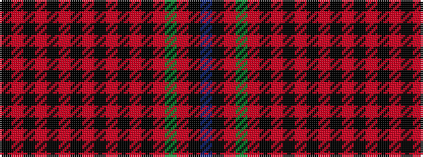

BKRGRKRKRKRKRKRKRK

It is a 18 stripe tartan.

<figure class="pat-woven">

<figcaption>idealised sample</figcaption>
</figure>

## Colour Sequence



## Tartans with this colour sequence

| Tartans |
|---------------|
| [Hebridean 6](/setts/s18/k2r1k10r1k2r1k10r1k2r1k10r2k10r2dg2r2k10db2~x2/)|
||
